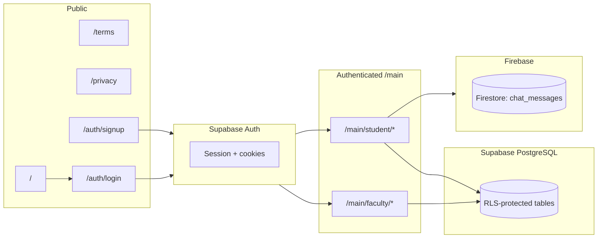
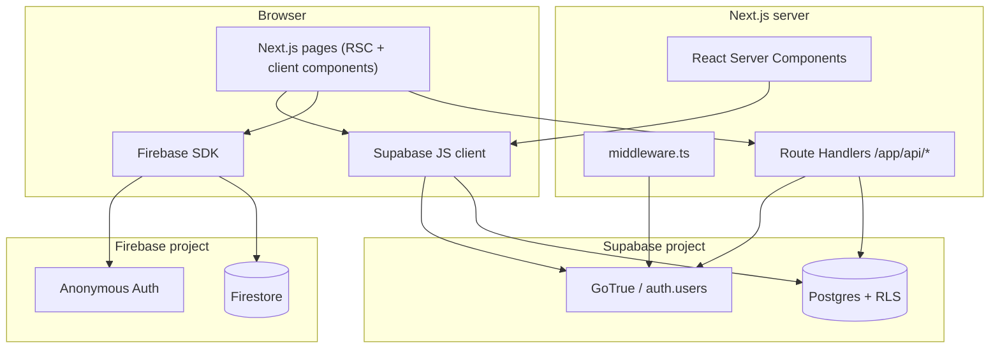
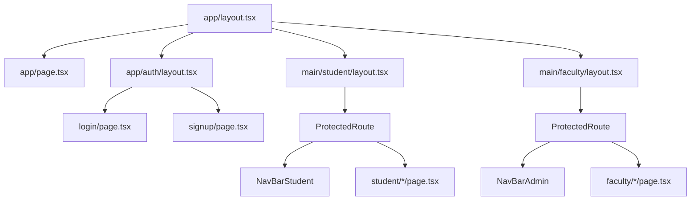
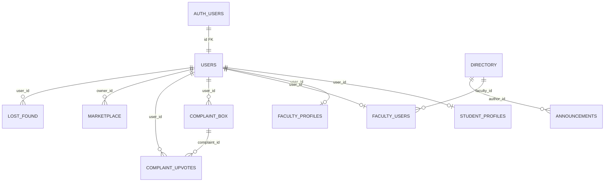

# EchoCampus

**Meet. Learn. Build.**

EchoCampus is a **role-aware campus web application** that connects students and faculty around shared digital services: official announcements, a student complaint box with peer upvotes, a student-only marketplace, campus lost & found, a searchable faculty directory, and a **Firebase-backed anonymous group chat** where students appear under a **session code** instead of their real name.

This repository is a **single Next.js monolith** (App Router) that uses **Supabase** for authentication, PostgreSQL data, and Row Level Security (RLS), plus **Firebase** (anonymous auth + Firestore) for real-time chat only.

---

## Table of contents

1. [Purpose, audience, and problems solved](#1-purpose-audience-and-problems-solved)
2. [High-level product workflow](#2-high-level-product-workflow)
3. [Technology stack](#3-technology-stack)
4. [Repository layout](#4-repository-layout)
5. [System architecture](#5-system-architecture)
6. [Authentication and authorization](#6-authentication-and-authorization)
7. [HTTP API reference (Next.js Route Handlers)](#7-http-api-reference-nextjs-route-handlers)
8. [Database model, RLS, and limits](#8-database-model-rls-and-limits)
9. [Frontend architecture and navigation](#9-frontend-architecture-and-navigation)
10. [Configuration and environment variables](#10-configuration-and-environment-variables)
11. [Setup, local development, and deployment](#11-setup-local-development-and-deployment)
12. [Developer onboarding](#12-developer-onboarding)
13. [Code quality and improvement opportunities](#13-code-quality-and-improvement-opportunities)
14. [Related documentation in this repo](#14-related-documentation-in-this-repo)

---

## 1. Purpose, audience, and problems solved

### Primary purpose

Provide a **centralized, authenticated** campus hub where:

- Faculty can **publish announcements** tied to their official directory identity.
- Students can **raise complaints** (with optional anonymity at the data layer) and **upvote** issues.
- Students can **list and sell** items with contact details guarded by RLS (faculty cannot read marketplace rows).
- Any authenticated role can **report lost/found items**, optionally with a small inline image (stored as a data URL in PostgreSQL).
- Everyone can **browse the faculty directory** (read-only from the client; rows are maintained outside the app).
- Students can participate in a **low-friction anonymous chat room** keyed by a per-student **session code** stored in Supabase.

### Target users

| Role | Typical use |
|------|-------------|
| **Student** | Dashboard, marketplace, complaints, lost & found, directory, profile, anonymous chat |
| **Faculty** | Dashboard, announcements, viewing complaints, lost & found, directory, profile |
| **Admin** | Same route access as faculty (`/main/faculty/*`); `admin` is **not** self-service in the UI—it must be assigned in the database |

### Problems addressed

- **Fragmentation**: multiple campus needs (news, grievances, trading, lost items) in one product surface.
- **Trust and safety (partial)**: RLS enforces who can insert/update/read which rows; complaint anonymity is enforced in the complaints API response shaping when `is_anonymous` is true.
- **Faculty identity**: announcements reference `directory.id` so posts are anchored to official directory records, not arbitrary user text.

---

## 2. High-level product workflow



1. A visitor hits **`/`** (marketing-style landing) and follows **Login** or **Signup**.
2. **Supabase Auth** establishes a session (cookies managed by `@supabase/ssr` in middleware and route handlers).
3. On successful login/signup, client code ensures a row in **`public.users`**, reads **`role`**, and routes to **`/main/student/...`** or **`/main/faculty/...`**.
4. Most features read/write **PostgreSQL via the Supabase client** (browser) or **Route Handlers** (server) under **`/api/*`**.
5. **Anonymous chat** uses **Firebase Anonymous Auth** + **Firestore**; display names come from **`sessionStorage.userSessionCode`**, populated from **`student_profiles.session_code`**.

---

## 3. Technology stack

| Concern | Technology | Notes |
|--------|-------------|--------|
| UI framework | **React 19** | Functional components, client components where `"use client"` is declared |
| App framework | **Next.js 16** (App Router) | File-based routing under `app/`; layouts nest by segment |
| Language | **TypeScript 5** | `strict` mode enabled in `tsconfig.json` |
| Styling | **Tailwind CSS 4** | `@tailwindcss/postcss`, utility classes throughout |
| Icons | **lucide-react** | Nav, forms, dashboards |
| Primary backend | **Supabase** | Auth + Postgres + RLS; accessed from **browser** (`createBrowserClient`) and **server** (`createServerClient`) |
| SSR auth cookies | **`@supabase/ssr`** | Middleware + API routes refresh/read cookies |
| Secondary realtime | **Firebase 12** | `firebase/app`, `firebase/auth`, `firebase/firestore` in `src/lib/firebase.ts` |
| Lint / format | **ESLint 9** + `eslint-config-next` | Run `npm run lint` in CI or locally |

### What is *not* in this repo

- **No Jest/Vitest/Playwright** (or other) automated test suites were found.
- **No Docker**, **no Kubernetes manifests**, **no CI workflow files** (e.g. `.github/workflows`) in the workspace snapshot used for this analysis.
- **PWA** assets (manifest, service worker) are **not implemented** in code; see `PWA.md` for a planned approach.

---

## 4. Repository layout

### 4.1 Annotated tree (source-aligned)

> Paths are relative to the repository root. `public/` contains static assets (default Next.js SVGs). `color.txr` appears to be a stray non-code file and is not part of the application runtime.

```
echo-campus/
├── app/                          # Next.js App Router: pages, layouts, route handlers
│   ├── layout.tsx                # Root HTML shell, global metadata
│   ├── globals.css               # Global styles
│   ├── page.tsx                  # Public landing (marketing + feature summary)
│   ├── terms/page.tsx            # Terms of Service
│   ├── privacy/page.tsx          # Privacy Policy
│   ├── auth/
│   │   ├── layout.tsx            # Minimal wrapper for auth pages
│   │   ├── login/page.tsx        # Supabase password login + role routing
│   │   └── signup/page.tsx       # Supabase signup + optional faculty email gate (RPC)
│   ├── api/                      # Next.js Route Handlers (JSON APIs)
│   │   ├── complaints/route.ts
│   │   ├── complaints/upvote/route.ts
│   │   ├── marketplace/route.ts
│   │   └── marketplace/sold/route.ts
│   └── main/
│       ├── student/
│       │   ├── layout.tsx        # ProtectedRoute + student chrome (NavBarStudent, footer)
│       │   ├── dashboard/page.tsx
│       │   ├── announcements/page.tsx
│       │   ├── chat/page.tsx     # Firebase Firestore anonymous chat
│       │   ├── complaint/page.tsx
│       │   ├── directory/page.tsx
│       │   ├── lost-found/page.tsx
│       │   ├── marketplace/page.tsx
│       │   └── profile/page.tsx
│       └── faculty/
│           ├── layout.tsx        # ProtectedRoute + faculty chrome (NavBarAdmin, footer)
│           ├── dashboard/page.tsx
│           ├── announcements/page.tsx
│           ├── complaints/page.tsx
│           ├── directory/page.tsx
│           ├── lost-found/page.tsx
│           └── profile/page.tsx
├── src/
│   ├── middleware.ts             # Supabase session + role-based redirect for /main/*
│   ├── components/               # Reusable UI modules
│   ├── hooks/                    # Client hooks (session code, email)
│   ├── lib/                      # Supabase + Firebase clients, auth helpers
│   ├── types/                    # Shared TS interfaces
│   └── utils/                    # Small pure helpers (session code generator)
├── assets/
│   ├── sql/
│   │   ├── 01_tables_relations.sql   # Canonical DDL: tables, FKs, indexes
│   │   └── 02_functions_triggers_policies.sql  # RLS, triggers, auth sync
│   └── EchoCampus_Documentation.txt  # Human-readable rules (kept in sync with SQL)
├── public/                       # Static files served as-is
├── eslint.config.mjs
├── next.config.ts                # Default/empty extension point
├── postcss.config.mjs
├── package.json
├── package-lock.json
├── tsconfig.json
├── PWA.md                        # PWA implementation checklist (not shipped)
├── tree.txt                      # Older tree snapshot (may drift from reality)
└── README.md                     # This file
```

### 4.2 Module responsibilities

| Area | Responsibility |
|------|----------------|
| `app/` | Routing, per-route metadata, composition of layouts and pages |
| `app/api/` | Server-side JSON endpoints for complaints + marketplace (cookie-aware Supabase) |
| `src/components/` | Feature UI: lists, forms, navbars, footers, `ProtectedRoute` |
| `src/lib/` | `supabaseClient` (browser), `supabaseConfig` (env validation), `firebase` init, `authProfile` (user row + session code) |
| `src/middleware.ts` | First-line gate for `/main/*` using Supabase cookies + `public.users.role` |
| `assets/sql/` | **Source of truth** for schema and policies applied in Supabase SQL editor or migrations pipeline |

---

## 5. System architecture

### 5.1 Layered view



### 5.2 Data access patterns

| Feature | Primary access path | Why |
|---------|---------------------|-----|
| Announcements list | **Client** `supabase.from("announcements").select(...)` | RLS allows authenticated read |
| Announcement create | **Client** insert | RLS restricts inserts to mapped faculty |
| Directory | **Client** select | RLS: authenticated read |
| Lost & found list/create/delete | **Client** | RLS + delete-own policy |
| Complaints list / create | **Server** `/api/complaints` | Centralized shaping (anonymous masking) + shared GET logic |
| Complaint upvote | **Server** `/api/complaints/upvote` | Toggle logic + consistent error mapping |
| Marketplace list/create/sold | **Server** `/api/marketplace`, `/api/marketplace/sold` | Validates body; sets `owner_email` from auth user |
| Chat | **Client** Firebase only | Isolated from Supabase |

### 5.3 Component hierarchy (simplified)



### 5.4 Request lifecycle (example: complaints list)

1. Browser loads a page that mounts **`ComplaintList`** (`"use client"`).
2. `useEffect` calls **`fetch("/api/complaints")`** (same-origin, cookies sent).
3. Route handler builds a **server Supabase client** with `cookies()` from `next/headers`.
4. Handler calls **`supabase.auth.getUser()`** to identify the viewer (may be anonymous to the complaint author).
5. Handler queries **`complaint_box`** with an embedded count on **`complaint_upvotes`**, then optionally loads **`student_profiles`** for visible session codes.
6. JSON is returned; the list renders upvote state and counts.

### 5.5 Rendering strategy

- **Server Components** are used where files omit `"use client"` (e.g. student dashboard shell imports client children).
- **Client Components** handle forms, menus, Supabase calls from the browser, Firebase listeners, and anything using React state in event handlers.
- **No Redux/Zustand/React Query**—local `useState` + `useEffect` + direct `fetch`/`supabase` calls constitute state and data loading.

---

## 6. Authentication and authorization

### 6.1 Identity provider

- **Supabase Auth** with **email + password**.
- Sessions are persisted via **HTTP-only-style cookie flow** managed by `@supabase/ssr` (see `createServerClient` / `createBrowserClient` usage).

### 6.2 Signup flow (summary)

1. User submits **full name**, **email**, **password** on `/auth/signup`.
2. If **“I am a faculty member”** is checked, the client calls **`rpc("is_faculty_email", { input_email })`**.
3. **`supabase.auth.signUp`** creates `auth.users`.
4. If a session is returned immediately, **`ensureOwnUserRow`** inserts/aligns **`public.users`** and faculty mapping as needed, then **`fetchUserRole`** drives routing.
5. If email confirmation is required (`data.session` absent), the UI shows a **success message** and stops.

**Database-side role assignment**: SQL trigger **`on_auth_user_created`** on `auth.users` runs **`handle_new_auth_user()`**, which inserts into **`public.users`** with role **`faculty`** if the email matches **`directory`**, else **`student`**, and upserts **`faculty_profiles`** / **`faculty_users`** when applicable. **`admin`** is preserved on conflict and cannot be self-assigned via client policies.

### 6.3 Login flow (summary)

1. **`signInWithPassword`** on `/auth/login`.
2. **`ensureOwnUserRow`** ensures **`public.users`** exists and faculty linkage is healed for existing faculty rows.
3. **`fetchUserRole`** reads **`public.users.role`**.
4. **Students**: **`ensureStudentSessionCode`** creates/read **`student_profiles.session_code`**, stores it in **`sessionStorage`** as `userSessionCode`, sets `userRole`, navigates to **`/main/student/dashboard/`**.
5. **Faculty/admin**: session code removed from storage; navigates to **`/main/faculty/dashboard/`**.

### 6.4 Route protection

| Layer | File | Behavior |
|-------|------|----------|
| Middleware | `src/middleware.ts` | If path starts with `/main` and no Supabase user → redirect `/auth/login?next=...`. If user present → load `users.role` and **redirect wrong prefix** (`/main/faculty` vs `/main/student`). |
| Client guard | `src/components/ProtectedRoute.tsx` | Mirrors role split using `supabase.auth.getSession()` + `users.role`; signs out if profile missing |
| Matcher | `config.matcher` | **Excludes** `_next/static`, `_next/image`, `favicon.ico`, **`api/`**, **`auth/`** |

**Important**: `/auth/*` is excluded from the middleware matcher, so **middleware does not run on auth routes**—only on other matched paths (including `/main/*` and `/`).

### 6.5 Session metadata in the browser

- **`sessionStorage`**: `userSessionCode`, `userRole` (written on login/signup paths in auth pages).
- **`ProtectedRoute` / nav logout** also clear **`localStorage`** keys `userRole` and `userEmail`—these may be **legacy or unused** depending on code path; **`useUserEmail`** reads from the **Supabase session**, not `localStorage`.

### 6.6 Row Level Security (authorization at rest)

All business tables have **RLS enabled** with policies summarized in `assets/sql/02_functions_triggers_policies.sql` and in prose in `assets/EchoCampus_Documentation.txt`. Application routes must still avoid leaking data—especially **`/api/complaints` GET**, which strips identifiers for anonymous complaints.

---

## 7. HTTP API reference (Next.js Route Handlers)

All handlers use **`createServerClient`** from `@supabase/ssr` with Next **`cookies()`** to inherit the visitor’s Supabase session.

### 7.1 `GET /api/complaints`

| Item | Detail |
|------|--------|
| Auth | Optional; if logged in, computes `current_user_has_upvoted` |
| Supabase reads | `complaint_box` with `complaint_upvotes(count)`; optional `student_profiles` for visible session codes |
| Response | `{ complaints: Array<{ id, complaint, created_at, session_code, author_id, upvotes, current_user_has_upvoted }> }` |
| Masking | If `is_anonymous`, `session_code` is `"Anonymous"` and `author_id` is `null` |

### 7.2 `POST /api/complaints`

| Item | Detail |
|------|--------|
| Auth | **Required** (401 if missing) |
| Body | `{ complaint: string, isAnonymous?: boolean }` (extra fields from the current client are ignored) |
| Insert | `{ user_id, content: complaint, is_anonymous: !!isAnonymous }` |
| Errors | 400 invalid body; 429 if DB trigger message includes `"limit"` or generic unique violation branch; 500 otherwise |

**Implementation note:** The UI form in `src/components/complaints/complaintForm.tsx` currently POSTs `{ sessionCode, complaint, email }` and **does not send `isAnonymous`**. The API therefore sets **`is_anonymous` to `false`** unless the client is extended. This is a **real contract mismatch** between UI and API (documented here; not assumed behavior).

### 7.3 `POST /api/complaints/upvote`

| Item | Detail |
|------|--------|
| Auth | Required |
| Body | `{ complaintId: string }` |
| Logic | If existing row for `(complaint_id, user_id)` → delete (toggle off); else insert (toggle on) |
| Errors | 403 mapped from RLS violation code `42501` (“Students only”); 200/201 JSON includes `added` and `current_user_has_upvoted` |

### 7.4 `GET /api/marketplace`

| Item | Detail |
|------|--------|
| Auth | Implicitly required by RLS (**students only** for `select`) |
| Response | `{ listings: MarketplaceRow[] }` with normalized `owner_email` / `owner_name` |

### 7.5 `POST /api/marketplace`

| Item | Detail |
|------|--------|
| Auth | Required |
| Body | `{ product_title, description, price, owner_name, contact_info }` |
| Validation | Required string fields; `price` finite & `> 0`; `contact_info` must match `^\d{10}$`; `description` length ≥ 3 |
| Insert | `owner_email` taken from **`user.email`** (never from client) |

### 7.6 `POST /api/marketplace/sold`

| Item | Detail |
|------|--------|
| Auth | Required |
| Body | `{ id: string }` |
| Update | `is_sold: true` where `id` and **`owner_id = user.id`** |

---

## 8. Database model, RLS, and limits

### 8.1 ER-style diagram (logical)



`auth.users` is managed by Supabase; **`public.users.id`** references it with `ON DELETE CASCADE`.

### 8.2 Table purposes (short)

| Table | Purpose |
|-------|---------|
| `users` | App-level profile: `email`, `full_name`, **`role`**, timestamps |
| `student_profiles` | One row per student: **`session_code`** for anonymous labeling |
| `faculty_profiles` | Extended fields for faculty accounts |
| `directory` | Canonical faculty directory rows (email uniqueness) |
| `faculty_users` | Maps `auth user` → `directory.id` for announcement authorship |
| `announcements` | `author_id` → `directory.id` |
| `complaint_box` | Student-authored complaints |
| `complaint_upvotes` | Many-to-many votes; **unique** `(complaint_id, user_id)` |
| `marketplace` | Student marketplace listings |
| `lost_found` | Lost/found posts; optional `image_url` |

### 8.3 Rate / usage limits (database triggers)

Defined in `02_functions_triggers_policies.sql`:

| Trigger | Table | Rule |
|---------|-------|------|
| `enforce_lost_found_limit` | `lost_found` | Max **2 inserts / 24h** per user |
| `enforce_complaint_limit` | `complaint_box` | Max **1 insert / 7 days** per user |
| `enforce_marketplace_limit` | `marketplace` | Max **1 insert / 3 days** per owner |

### 8.4 Migrations

There is **no ORM migration folder** (no Prisma/Drizzle). Schema changes are intended to be applied via the SQL files under **`assets/sql/`** (documented in-repo workflow).

---

## 9. Frontend architecture and navigation

### 9.1 Route map (application pages)

| Path | Role | Description |
|------|------|-------------|
| `/` | Public | Landing + marketing |
| `/auth/login`, `/auth/signup` | Public | Supabase auth |
| `/main/student/dashboard` | Student | Widgets: announcements, marketplace, complaints, lost & found, quick links |
| `/main/student/announcements` | Student | Full announcement list |
| `/main/student/complaint` | Student | `ComplaintList` + `ComplaintForm` |
| `/main/student/marketplace` | Student | `MarketplaceList` + `MarketplaceForm` |
| `/main/student/lost-found` | Student | List + create form |
| `/main/student/directory` | Student | Faculty search UI (`DirectoryPage`) |
| `/main/student/chat` | Student | Firebase chat (anonymous Firebase user + session code label) |
| `/main/student/profile` | Student | Shows email + session code + join date |
| `/main/faculty/dashboard` | Faculty/admin | Light-themed dashboard widgets |
| `/main/faculty/announcements` | Faculty/admin | `AnnouncementForm` + list |
| `/main/faculty/complaints` | Faculty/admin | Read-only student complaints view |
| `/main/faculty/lost-found` | Faculty/admin | Same list component, different chrome |
| `/main/faculty/directory` | Faculty/admin | Reuses directory component |
| `/main/faculty/profile` | Faculty/admin | Faculty profile card |
| `/terms`, `/privacy` | Public | Static policy copy |

### 9.2 Notable UI behaviors

- **Student nav** (`NavBarStudent.tsx`): slide-out menu; **logout** calls `supabase.auth.signOut()` and clears storage keys.
- **Faculty nav** (`NavBarAdmin.tsx`): same pattern with different links (no student chat/marketplace routes).
- **Lost & Found search bar**: when `showSearch={true}`, the search input is **present in the UI** but **not wired** to query state in `LostFoundList.tsx` (filtering is not implemented).
- **Lost & Found images**: `LostFoundForm` reads files **≤ 200KB** and stores **`image_url` as a data URL string** in Postgres (simple but has size and performance implications at scale).

### 9.3 Anonymous chat specifics

- On mount, `onAuthStateChanged` ensures a **Firebase anonymous user** (`signInAnonymously`).
- Messages collection: **`chat_messages`**, ordered by `createdAt`, capped at **500** documents in the client query.
- Each sent document includes: `random_code` (from session code), `message`, `createdAt`, and **`expiresAt`** (24h from send). **No Cloud Function is included** in this repository to delete expired docs—cleanup must be configured in Firebase or a separate ops process if desired.

---

## 10. Configuration and environment variables

### 10.1 Supabase (`src/lib/supabaseConfig.ts`)

| Variable | Required | Purpose |
|----------|----------|---------|
| `NEXT_PUBLIC_SUPABASE_URL` | Yes | Project URL |
| `NEXT_PUBLIC_SUPABASE_PUBLISHABLE_KEY` **or** `NEXT_PUBLIC_SUPABASE_ANON_KEY` | Yes | Browser-safe key |
| — | — | Startup **throws** if missing |
| — | — | Guards against **`sb_secret_`** or JWT `role: service_role` accidentally used as the public key |

### 10.2 Firebase (`src/lib/firebase.ts`)

All keys are read from **`NEXT_PUBLIC_FIREBASE_*`** variables (see `.env.example`). **`measurementId`** is optional.

### 10.3 Build / runtime config

- **`next.config.ts`**: default export with no custom webpack headers or images config in-repo.
- **`eslint.config.mjs`**: Next.js core web vitals + TypeScript rules.
- **`.gitignore`**: ignores `.env*` (use `.env.example` + private `.env.local`).

---

## 11. Setup, local development, and deployment

### 11.1 Prerequisites

- **Node.js** compatible with Next.js 16 (Node 20+ recommended)
- A **Supabase** project with SQL from `assets/sql/` applied **in order**
- A **Firebase** project with **Anonymous** sign-in enabled and **Firestore** created (rules must allow your chosen security model—the repo does not ship Firestore rules files)

### 11.2 Install

```bash
npm install
```

### 11.3 Environment

Copy `.env.example` to **`.env.local`** (Next.js convention) and fill real values.

### 11.4 Run dev server

```bash
npm run dev
```

### 11.5 Scripts (`package.json`)

| Script | Command | Purpose |
|--------|---------|---------|
| `dev` | `next dev` | Local development |
| `build` | `next build` | Production bundle |
| `start` | `next start` | Serve production build |
| `lint` | `eslint` | Static analysis |
| `typecheck` | `tsc --noEmit` | Type checking |

### 11.6 Production deployment (typical)

1. Set environment variables on the host (e.g. Vercel project settings).
2. `npm run build` then `npm run start`, or use a platform that runs Next.js directly.
3. Ensure **Supabase Auth redirect URLs** allow your production domain.
4. Configure **Firebase authorized domains** for the same host.
5. Apply and maintain **Postgres migrations** from `assets/sql/` for every schema/policy change.

**No platform-specific IaC is present in this repository**—deployment is intentionally host-agnostic.

---

## 12. Developer onboarding

### 12.1 First day reading order

1. This **`README.md`** (system view).
2. **`assets/EchoCampus_Documentation.txt`** (business rules + RLS matrix).
3. **`assets/sql/01_tables_relations.sql`** then **`02_functions_triggers_policies.sql`** (exact policy language).
4. **`src/middleware.ts`** + **`src/components/ProtectedRoute.tsx`** (route model).
5. Feature vertical of interest:
   - Complaints: `app/api/complaints/*` + `src/components/complaints/*`
   - Marketplace: `app/api/marketplace/*` + `src/components/marketplace/*`
   - Announcements: `src/components/announcements/*` + RLS for `faculty_users`

### 12.2 Conventions observed

- **Alias imports**: `@/*` → `src/*` (`tsconfig.json` `paths`).
- **Client components**: explicitly marked `"use client"` at top of file.
- **Server-only secrets**: avoid putting service role keys in `NEXT_PUBLIC_*`; the project already validates the public key shape in `supabaseConfig.ts`.

### 12.3 Debugging tips

- If `/main` redirects unexpectedly, inspect **Supabase session cookies**, then confirm a row exists in **`public.users`** for the same `id` as `auth.users`.
- If faculty cannot post announcements, verify **`faculty_users`** mapping and that **`author_id`** matches `faculty_id`.
- If marketplace calls fail for faculty accounts, remember **RLS blocks faculty reads**—that is expected by schema design.

---

## 13. Code quality and improvement opportunities

This section is a **review based on static analysis and a local tool run**; it does not claim runtime profiling or production telemetry.

### 13.1 Strengths

- **Defense in depth**: middleware + client guard + Postgres RLS.
- **Clear SQL documentation** co-located with the app (`assets/sql`).
- **Server route** for complaints reduces risk of leaking anonymous author metadata compared to raw client selects.
- **Marketplace POST** refuses client-supplied `owner_email` and derives it from the authenticated user.

### 13.2 Findings

| Area | Detail |
|------|--------|
| Tooling | **`npm run lint`** and **`npm run typecheck`** are expected to pass on a clean tree. **`npm audit`** may still report upstream dependency advisories—review separately. |
| Storage consistency | Login uses **`sessionStorage`** for role/session code while logout also clears **`localStorage`** keys—worth reconciling for clarity. |
| `useSessionCode` | Returns memoized `sessionStorage` value with empty deps → **won’t update** if session code is set later in the same tab without remount; may matter for edge navigations. |
| Images in DB | Base64/data URL images in `lost_found.image_url` will **grow database size** quickly; consider object storage + URL references for production scale. |
| Firebase rules | Not in-repo; misconfiguration could **expose chat** or block legitimate users—treat as mandatory ops work. |
| Chat retention | `expiresAt` is written without an in-repo cleanup job. |

Previously noted gaps that are **addressed in the current codebase**: complaint **`POST` payload** matches the API (`complaint` + `isAnonymous`); Lost & Found **search** filters the list; unused **`@clerk/nextjs`** and **`@supabase/auth-helpers-nextjs`** were removed from `package.json`.

### 13.3 Scalability notes

- Firestore listener loads up to **500** messages per client—fine for a pilot, may need pagination for large campuses.
- Complaint GET loads all complaints in one request—monitor Postgres size and add pagination if the table grows.

---

## 14. Related documentation in this repo

| Artifact | Role |
|----------|------|
| `assets/EchoCampus_Documentation.txt` | Product + architecture reference (human prose) |
| `assets/sql/*.sql` | Canonical schema + RLS + triggers |
| `PWA.md` | **Plan only** for future PWA work—not active in the build |
| `.env.example` | Environment variable template for local setup |

---

## License and upstream

See `package.json` for declared **license (ISC)**, repository URL, and author metadata.

---

*Documentation generated from repository source and SQL artifacts. When the product changes, update `assets/sql/`, `assets/EchoCampus_Documentation.txt`, and this README together.*
