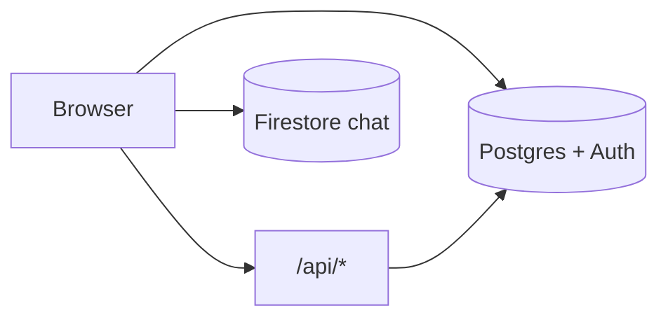

# EchoCampus

**Meet. Learn. Build.**

EchoCampus is a role-aware campus web app for students and faculty: announcements, complaints with upvotes, a student marketplace, lost & found, a faculty directory, and Firebase-backed anonymous group chat (students appear by session code, not real name).

Single **Next.js** monolith (App Router). **Supabase** handles auth, PostgreSQL, and RLS. **Firebase** (anonymous auth + Firestore) powers real-time chat only.

---

## Stack

| Layer | Tech |
|-------|------|
| Framework | Next.js 16 (App Router), React 19, TypeScript 5 |
| Styling | Tailwind CSS 4, lucide-react |
| Primary backend | Supabase (Auth + Postgres + RLS) via `@supabase/ssr` |
| Chat | Firebase 12 (anonymous auth, Firestore `chat_messages`) |

---

## Quick start

**Prerequisites:** Node.js 20+, a Supabase project, a Firebase project (chat only).

1. Clone and install:

```bash
npm install
```

2. Copy `.env.example` → `.env.local` and fill Supabase + Firebase values.

3. Apply SQL in order in the Supabase SQL editor:

   - `assets/sql/01_tables_relations.sql`
   - `assets/sql/02_functions_triggers_policies.sql`

4. Firebase: enable **Anonymous** sign-in and create **Firestore**. Configure security rules for your environment (not shipped in this repo).

5. Run:

```bash
npm run dev
```

Open [http://localhost:3000](http://localhost:3000).

| Script | Purpose |
|--------|---------|
| `npm run dev` | Local dev server |
| `npm run build` | Production build |
| `npm run start` | Serve production build |
| `npm run lint` | ESLint |
| `npm run typecheck` | `tsc --noEmit` |

---

## Environment variables

See `.env.example` for the full template.

| Variable | Required | Purpose |
|----------|----------|---------|
| `NEXT_PUBLIC_SUPABASE_URL` | Yes | Supabase project URL |
| `NEXT_PUBLIC_SUPABASE_PUBLISHABLE_KEY` or `NEXT_PUBLIC_SUPABASE_ANON_KEY` | Yes | Browser-safe key (never service role) |
| `NEXT_PUBLIC_FIREBASE_*` | Yes for chat | Firebase web config (`API_KEY`, `AUTH_DOMAIN`, `PROJECT_ID`, etc.) |
| `NEXT_PUBLIC_FIREBASE_MEASUREMENT_ID` | No | Analytics |

`src/lib/supabaseConfig.ts` throws at startup if Supabase env is missing or a secret/service key is used as the public key.

---

## Folder structure

```
echo-campus/
├── app/                    # Routes, layouts, API handlers
│   ├── api/                # complaints, marketplace (server)
│   ├── auth/               # login, signup
│   └── main/
│       ├── student/        # student features + chat
│       └── faculty/        # faculty/admin features
├── src/
│   ├── middleware.ts       # Session + role redirects for /main/*
│   ├── components/         # UI by feature
│   ├── hooks/              # useSessionCode, useUserEmail
│   ├── lib/                # Supabase, Firebase, authProfile
│   └── utils/
├── assets/sql/             # Canonical schema + RLS (source of truth)
├── docs/                   # Detailed technical docs
└── public/
```

Path alias: `@/*` → `src/*`.

---

## Roles and routes

| Role | Routes | Notes |
|------|--------|-------|
| **Student** | `/main/student/*` | Marketplace, complaints, chat, profile with session code |
| **Faculty** | `/main/faculty/*` | Announcements, read complaints, no marketplace |
| **Admin** | Same as faculty | Assign `role = 'admin'` in DB only—not self-service |

Public: `/`, `/auth/login`, `/auth/signup`, `/terms`, `/privacy`.

---

## Architecture (summary)

- **Browser:** Supabase client for most features; `fetch` to `/api/*` for complaints and marketplace; Firebase SDK for chat.
- **Edge/server:** `src/middleware.ts` guards `/main/*`; Route Handlers use cookie-aware Supabase server clients.
- **Database:** Postgres RLS on all business tables; schema changes go through `assets/sql/`.



More detail: [docs/architecture.md](docs/architecture.md).

---

## Documentation

| Doc | Contents |
|-----|----------|
| [docs/app-flow.md](docs/app-flow.md) | Signup, login, routing, session code, chat |
| [docs/architecture.md](docs/architecture.md) | Layers, data access patterns, components |
| [docs/api.md](docs/api.md) | Route Handler reference |
| [docs/database-schema.md](docs/database-schema.md) | Tables, RLS, triggers, limits |
| [docs/deployment.md](docs/deployment.md) | Supabase/Firebase setup and production deploy |

**Also in repo**

| File | Purpose |
|------|---------|
| `assets/sql/*.sql` | Canonical DDL, RLS, triggers |
| `PWA.md` | **Planned** PWA checklist—not implemented |
| `.env.example` | Env template |

---

## Important decisions

1. **Dual backend:** Supabase for durable campus data; Firebase only for ephemeral anonymous chat.
2. **Defense in depth:** Middleware role redirects + `ProtectedRoute` + Postgres RLS.
3. **No ORM migrations:** Schema lives in `assets/sql/` and is applied manually (or via your own pipeline).
4. **Complaints API:** Server routes mask anonymous authors; marketplace `owner_email` always comes from the auth session, not the client.
5. **Faculty announcements:** `announcements.author_id` references `directory.id`, not `users.id`.
6. **Student identity in chat:** `student_profiles.session_code` → `sessionStorage.userSessionCode` → Firestore `random_code`.

---

## Known limitations

- No automated tests, Docker, or CI configs in-repo.
- Firestore security rules and expired-message cleanup are **ops responsibilities** (`expiresAt` is set on send; no Cloud Function in-repo).
- Lost & found images are stored as **data URLs** in Postgres (≤ 200KB in the form)—fine for a pilot, not ideal at scale.
- Chat loads up to **500** messages per client snapshot.

---

## License

ISC — see `package.json` for author and repository URL.

When the product changes, update `assets/sql/` and the matching doc under `docs/`.
