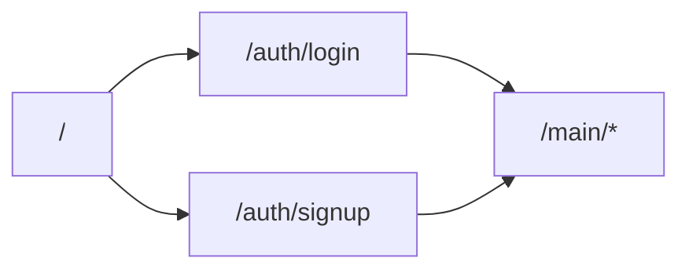
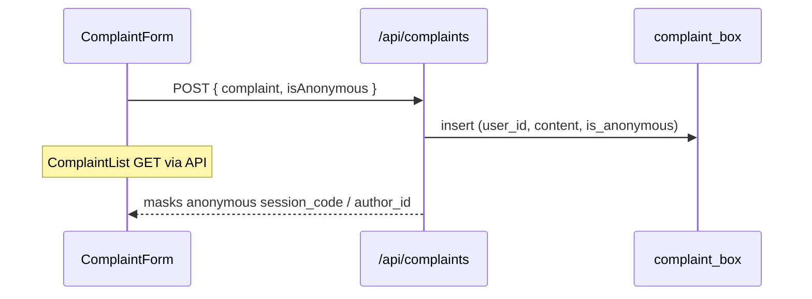

# App flow

End-to-end flows for authentication, routing, and major features.

## Public entry

Landing (`app/page.tsx`) links to login/signup. Terms and privacy are static pages at `/terms` and `/privacy`.

---

## Signup (`/auth/signup`)

1. User submits full name, email, password.
2. Optional **“I am a faculty member”** → client calls `rpc("is_faculty_email", { input_email })` before signup.
3. `supabase.auth.signUp` creates `auth.users`.
4. Database trigger `on_auth_user_created` → `handle_new_auth_user()`:
   - Inserts `public.users` with role **`faculty`** if email exists in `directory`, else **`student`**
   - Upserts `faculty_profiles` / `faculty_users` when applicable
   - **`admin`** is preserved on conflict; cannot be self-assigned via client policies
5. If session is returned immediately:
   - `ensureOwnUserRow` aligns client-side profile
   - `fetchUserRole` → route to `/main/student/dashboard` or `/main/faculty/dashboard`
   - Students: `ensureStudentSessionCode` → `sessionStorage.userSessionCode`
6. If email confirmation is required (no session), UI shows success and stops.

---

## Login (`/auth/login`)

1. `signInWithPassword` (email normalized to lowercase).
2. `ensureOwnUserRow` — ensures `public.users` and faculty linkage.
3. `fetchUserRole` from `public.users.role`.
4. Routing:
   - **faculty / admin** → `sessionStorage.userRole` → `/main/faculty/dashboard/`
   - **student** → `ensureStudentSessionCode` → `sessionStorage.userSessionCode` + `userRole` → `/main/student/dashboard/`

Middleware and `ProtectedRoute` enforce the same role prefixes on subsequent navigation.

---

## Authenticated navigation

### Student (`/main/student/*`)

| Route | Feature |
|-------|---------|
| `/dashboard` | Widgets: announcements, marketplace, complaints, lost & found |
| `/announcements` | Full announcement list |
| `/complaint` | Submit + list complaints (API) |
| `/marketplace` | Listings + create (API) |
| `/lost-found` | List, search, create, delete own |
| `/directory` | Faculty directory search |
| `/chat` | Firebase anonymous chat |
| `/profile` | Email, session code, join date |

### Faculty / admin (`/main/faculty/*`)

| Route | Feature |
|-------|---------|
| `/dashboard` | Faculty widgets |
| `/announcements` | Create + list (client Supabase) |
| `/complaints` | Read-only complaint view |
| `/lost-found` | Shared list component |
| `/directory` | Same directory UI |
| `/profile` | Faculty profile |

Faculty cannot access student marketplace or chat routes (middleware redirect).

---

## Complaint flow

- Default in UI: anonymous checkbox **on** (`isAnonymous: true`).
- Rate limit: **1 complaint / 7 days** per user (DB trigger).

---

## Marketplace flow

- List/create via `/api/marketplace`; mark sold via `/api/marketplace/sold`.
- RLS: **students only** for read/write; faculty accounts cannot list marketplace rows.
- Rate limit: **1 listing / 3 days** per owner (DB trigger).

---

## Lost & found flow

- Client Supabase: list, insert, delete own posts.
- Optional image: file ≤ 200KB → base64 data URL in `image_url`.
- Search on full list page filters title, description, location, contact (client-side).
- Rate limit: **2 posts / 24 hours** per user.

---

## Anonymous chat flow

1. Student opens `/main/student/chat`.
2. `useSessionCode` reads `sessionStorage.userSessionCode` (from login).
3. Firebase `signInAnonymously` if no Firebase user.
4. Listener on `chat_messages` ordered by `createdAt`, limit 500.
5. Send: `{ random_code: sessionCode, message, createdAt, expiresAt }` (`expiresAt` = +24h).

Display name in UI is the session code, not Supabase email. Firebase auth is **independent** of Supabase session (both must work for chat).

---

## Logout

Nav components call `supabase.auth.signOut()` and clear `sessionStorage` / selected `localStorage` keys, then redirect to login.
