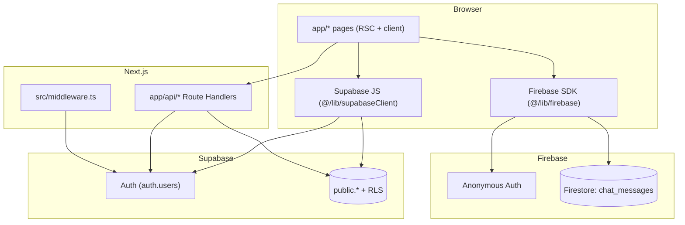

# Architecture

EchoCampus is a **single Next.js monolith** using the App Router. There is no separate API server or BFF beyond Next.js Route Handlers under `app/api/`.

## Layers



## Data access by feature

| Feature | Access path | Rationale |
|---------|-------------|-----------|
| Announcements | Client `supabase.from("announcements")` | RLS: authenticated read; faculty insert via mapping |
| Directory | Client select | RLS: authenticated read |
| Lost & found | Client CRUD | RLS + per-user delete |
| Complaints | Server `/api/complaints` | Masks anonymous authors in GET |
| Complaint upvotes | Server `/api/complaints/upvote` | Toggle + consistent errors |
| Marketplace | Server `/api/marketplace`, `/api/marketplace/sold` | Validation; `owner_email` from session |
| Chat | Client Firebase only | Isolated from Supabase |

## Route protection

| Layer | Location | Behavior |
|-------|----------|----------|
| Middleware | `src/middleware.ts` | Unauthenticated `/main/*` → `/auth/login?next=...`. Wrong role prefix → correct dashboard. |
| Client guard | `src/components/ProtectedRoute.tsx` | Re-checks session + `users.role`; signs out if profile missing |
| Matcher | `middleware` `config.matcher` | Excludes `_next/static`, `_next/image`, `favicon.ico`, **`api/`**, **`auth/`** |

Auth pages (`/auth/*`) are **not** covered by middleware—only `/main/*` and other matched paths.

## State management

No Redux, Zustand, or React Query. Features use local `useState` / `useEffect`, direct Supabase calls, or `fetch` to Route Handlers.

**Browser session metadata**

- `sessionStorage`: `userSessionCode`, `userRole` (set on login/signup for students)
- `useUserEmail` reads from the Supabase session, not storage
- Logout clears `sessionStorage` and some legacy `localStorage` keys

## Component layout

```
app/layout.tsx
├── / (landing)
├── /auth/* (login, signup)
└── /main/*
    ├── student/layout.tsx → ProtectedRoute + NavBarStudent
    └── faculty/layout.tsx → ProtectedRoute + NavBarAdmin
```

Feature UI lives under `src/components/` grouped by domain (announcements, complaints, marketplace, shared LostFound/Directory).

## Key libraries

| Module | Role |
|--------|------|
| `src/lib/supabaseConfig.ts` | Env validation; public key guard |
| `src/lib/supabaseClient.ts` | Browser Supabase client |
| `src/lib/authProfile.ts` | `ensureOwnUserRow`, `fetchUserRole`, `ensureStudentSessionCode` |
| `src/lib/firebase.ts` | Firebase app, anonymous auth (session persistence), Firestore |
| `src/utils/generateUniqueCode.ts` | Session code generation for new students |

## Rendering

- Files **without** `"use client"` are Server Components by default.
- Client components handle forms, Supabase/Firebase from the browser, and interactive UI.

## Related docs

- [app-flow.md](./app-flow.md) — auth and navigation flows
- [api.md](./api.md) — HTTP handlers
- [database-schema.md](./database-schema.md) — tables and RLS
