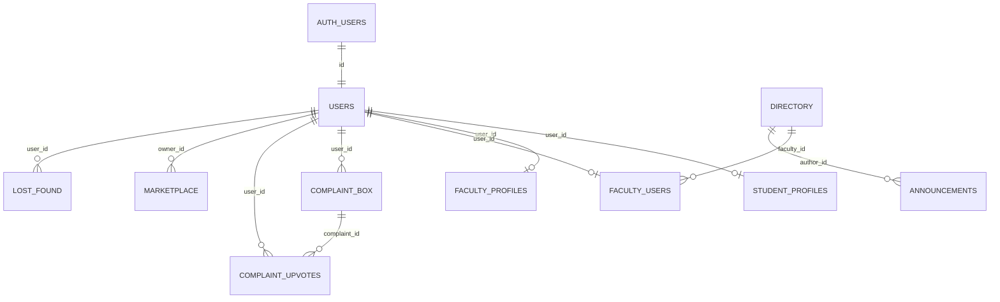

# Database schema

**Source of truth:** apply in order in your Supabase project:

1. `assets/sql/01_tables_relations.sql` — tables, FKs, indexes  
2. `assets/sql/02_functions_triggers_policies.sql` — RLS, triggers, auth sync  

There is no Prisma/Drizzle migration folder in this repo.

---

## Entity relationship (logical)

`public.users.id` references `auth.users(id)` with `ON DELETE CASCADE`.

---

## Tables

| Table | Purpose |
|-------|---------|
| `users` | App profile: `email`, `full_name`, `role` (`student` \| `faculty` \| `admin`) |
| `student_profiles` | One row per student; **`session_code`** for anonymous labeling |
| `faculty_profiles` | Department, phone, cabin, experience |
| `directory` | Canonical faculty directory (unique email) |
| `faculty_users` | Maps auth user → `directory.id` for announcements |
| `announcements` | `author_id` → `directory.id` |
| `complaint_box` | Student complaints; `is_anonymous` flag |
| `complaint_upvotes` | Unique `(complaint_id, user_id)` |
| `marketplace` | Student listings; `owner_id`, `is_sold` |
| `lost_found` | Posts; optional `image_url` (text / data URL) |

---

## Auth sync

On `auth.users` insert, trigger **`on_auth_user_created`** runs **`handle_new_auth_user()`**:

- Creates `public.users` with role from directory match
- Sets up faculty profile/mapping when email is in `directory`
- Does not allow clients to self-assign `admin`

Signup UI may also call **`is_faculty_email(input_email)`** (security definer RPC) before `signUp`.

Client helper **`ensureOwnUserRow`** (`src/lib/authProfile.ts`) heals missing rows and faculty linkage on login.

---

## Row Level Security (summary)

All listed business tables have **RLS enabled**. Full policy text is in `02_functions_triggers_policies.sql`. Highlights:

| Area | Rule of thumb |
|------|----------------|
| `users` | Select/update own row only; no client UPDATE of `role` |
| `student_profiles` | Authenticated read; insert/update own |
| `directory` | Authenticated read |
| `announcements` | Authenticated read; insert only if user mapped in `faculty_users` |
| `complaint_box` | Students insert/read; faculty read |
| `complaint_upvotes` | Students only |
| `marketplace` | **Students only** (faculty cannot select) |
| `lost_found` | Authenticated CRUD with delete-own |

Complaint **GET** still goes through `/api/complaints` to strip anonymous author fields in JSON.

---

## Rate limits (triggers)

| Trigger | Table | Limit |
|---------|-------|-------|
| `enforce_lost_found_limit` | `lost_found` | 2 inserts / 24h per user |
| `enforce_complaint_limit` | `complaint_box` | 1 insert / 7 days per user |
| `enforce_marketplace_limit` | `marketplace` | 1 insert / 3 days per owner |

Violations surface as errors (API maps some to HTTP 429 for complaints).

---

## Operational notes

- **Directory data** is maintained in Supabase (not seeded by the app UI).
- **Admin role** must be set manually in `public.users`.
- Changing schema: edit SQL files, apply to Supabase, update this doc and [api.md](./api.md) if behavior changes.
